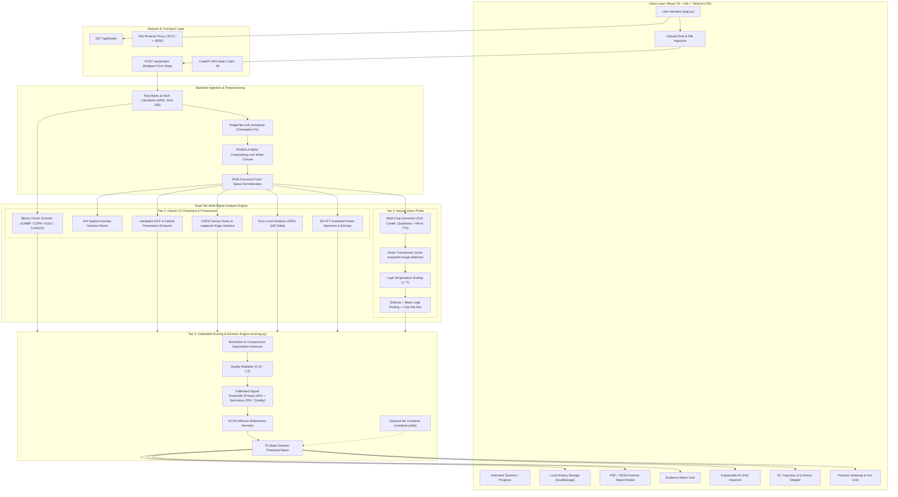
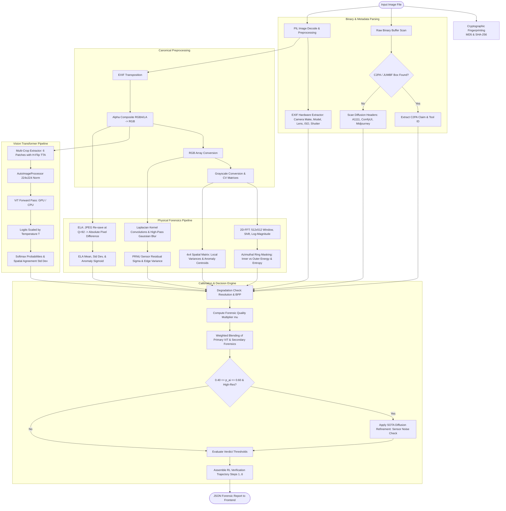
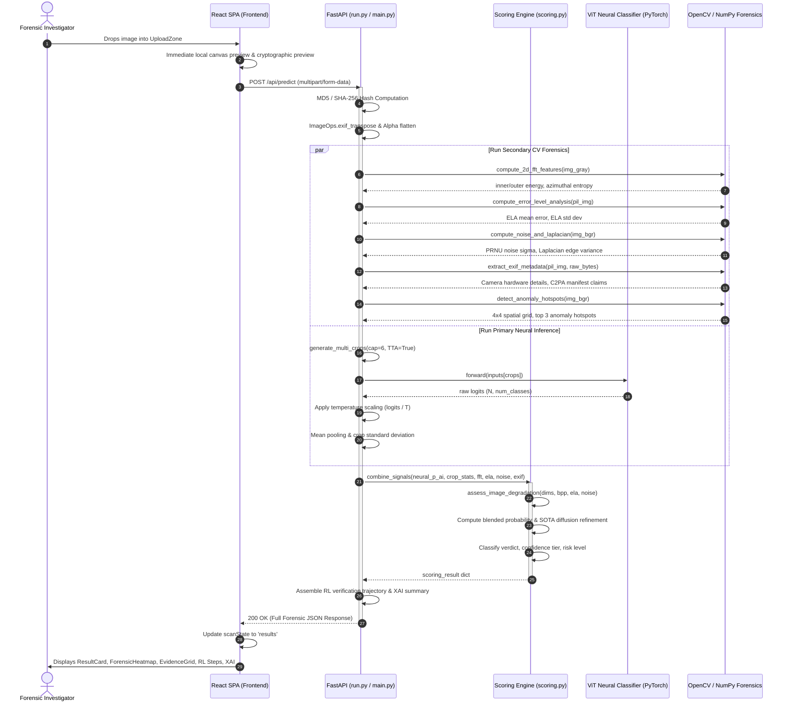
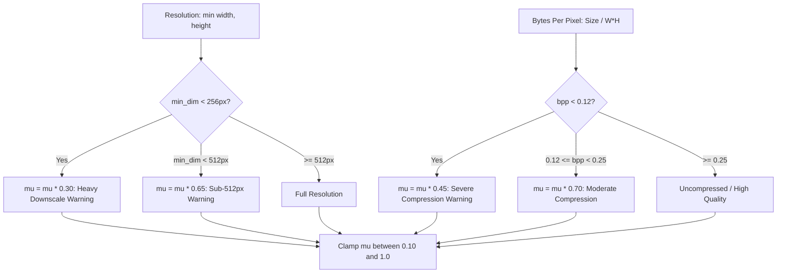
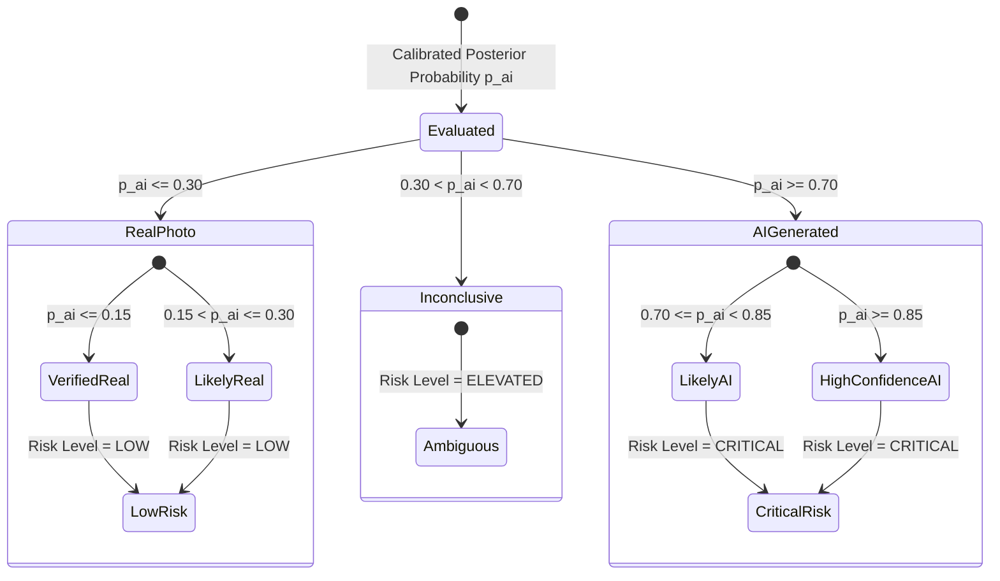
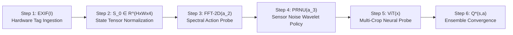

# AI Image Detection & Multi-Signal Forensics System
## Comprehensive Technical Documentation & Architectural Specification

> **Version:** 2.1.0  
> **Classification:** High-Assurance Digital Media Forensics & Provenance Verification  
> **Core Engine:** Hybrid Vision Transformer (ViT) Ensemble + Optical Physics Forensics (2D-FFT, ELA, PRNU, C2PA)  
> **Frontend:** React 18 · Vite · Tailwind CSS · Canvas API  
> **Backend:** FastAPI · PyTorch · HuggingFace Transformers · OpenCV · NumPy · Scikit-Learn  

---

## Table of Contents

1. [Executive Summary](#1-executive-summary)
2. [End-to-End System Architecture](#2-end-to-end-system-architecture)
   - [2.1 High-Level Architecture](#21-high-level-architecture)
   - [2.2 Detailed Data Flow Diagram](#22-detailed-data-flow-diagram)
   - [2.3 Component Interaction Sequence Diagram](#23-component-interaction-sequence-diagram)
3. [Deep Learning & Neural Vision Pipeline](#3-deep-learning--neural-vision-pipeline)
   - [3.1 Primary Classifier Architecture](#31-primary-classifier-architecture)
   - [3.2 Dynamic Label Mapping](#32-dynamic-label-mapping)
   - [3.3 Multi-Crop Sliding Window & Test-Time Augmentation (TTA)](#33-multi-crop-sliding-window--test-time-augmentation-tta)
   - [3.4 Temperature-Scaled Posterior Calibration](#34-temperature-scaled-posterior-calibration)
4. [Secondary Computer Vision Forensics (Physics Engine)](#4-secondary-computer-vision-forensics-physics-engine)
   - [4.1 2D Fast Fourier Transform (2D-FFT) Spectral Analysis](#41-2d-fast-fourier-transform-2d-fft-spectral-analysis)
   - [4.2 Error Level Analysis (ELA) Compression Residuals](#42-error-level-analysis-ela-compression-residuals)
   - [4.3 Sensor PRNU & Laplacian Edge Variance](#43-sensor-prnu--laplacian-edge-variance)
   - [4.4 EXIF Hardware Provenance & Deep C2PA Manifest Scanner](#44-exif-hardware-provenance--deep-c2pa-manifest-scanner)
   - [4.5 Spatial Anomaly Grid (4×4 Matrix & Hotspot Localization)](#45-spatial-anomaly-grid-44-matrix--hotspot-localization)
5. [Calibrated Scoring Engine & Decision Logic](#5-calibrated-scoring-engine--decision-logic)
   - [5.1 Image Quality & Compression Attenuation](#51-image-quality--compression-attenuation)
   - [5.2 Dynamic Signal Ensemble Formula](#52-dynamic-signal-ensemble-formula)
   - [5.3 SOTA Diffusion Refinement Heuristic](#53-sota-diffusion-refinement-heuristic)
   - [5.4 Pluggable Machine Learning Combiner](#54-pluggable-machine-learning-combiner)
   - [5.5 Verdict Classification Matrix & Risk Tiers](#55-verdict-classification-matrix--risk-tiers)
6. [Reinforcement Learning (RL) Verification Trajectory](#6-reinforcement-learning-rl-verification-trajectory)
7. [Frontend Architecture & User Interface System](#7-frontend-architecture--user-interface-system)
   - [7.1 Component Hierarchy](#71-component-hierarchy)
   - [7.2 UI Modules & Visual Forensics](#72-ui-modules--visual-forensics)
   - [7.3 Dual Operational Modes (Unified vs. Hot-Reload Dev)](#73-dual-operational-modes-unified-vs-hot-reload-dev)
   - [7.4 Client-Side Fallback Engine](#74-client-side-fallback-engine)
8. [REST API Specification](#8-rest-api-specification)
   - [8.1 Endpoints Overview](#81-endpoints-overview)
   - [8.2 Request & Response Schemas](#82-request--response-schemas)
9. [Benchmark, Calibration & Evaluation Suite](#9-benchmark-calibration--evaluation-suite)
   - [9.1 Benchmark Harness (`backend/evaluate.py`)](#91-benchmark-harness-backendevaluatepy)
   - [9.2 Metric Formulations & Threshold Sweeps](#92-metric-formulations--threshold-sweeps)
10. [Setup, Installation & Deployment Guide](#10-setup-installation--deployment-guide)
11. [Known Limitations & Security Considerations](#11-known-limitations--security-considerations)

---

## 1. Executive Summary

The **AI Image Detection & Multi-Signal Forensics System** is an enterprise-grade digital media verification platform engineered to distinguish authentic photographic images captured by optical physical cameras from synthetic media generated by artificial intelligence models (Diffusion models, GANs, Autoregressive transformers, and Neural Upscalers).

Modern generative models (e.g., Midjourney v5/v6, FLUX.1, Stable Diffusion XL, DALL-E 3, Adobe Firefly) have largely eliminated visible human-detectable visual flaws (such as distorted hands or inconsistent lighting). Consequently, pure unimodal neural classifiers suffer from blind spots, domain shift, and severe false positives on clean or high-ISO human photographs.

To resolve this challenge, this system employs a **Calibrated Multi-Signal Hybrid Ensemble** architecture:
1. **Primary Vision Transformer (ViT)**: Evaluates semantic, perceptual, and structural generative manifolds across multi-crop spatial patches.
2. **Deterministic Physics-Based Forensics**: Inspects 2D frequency spectral decay ($1/f$ falloff), JPEG quantization error grids (ELA), CMOS sensor photo-response non-uniformity (PRNU), and high-frequency edge variance.
3. **Cryptographic & Header Provenance**: Scans raw binary headers for C2PA Content Credentials manifests, JUMBF boxes, and metadata signatures embedded by generative frameworks (e.g., ComfyUI, Automatic1111, DALL-E, Firefly).
4. **Adaptive Calibration Layer**: Dynamically attenuates secondary forensic weights when images suffer from social media downsampling or heavy compression, preventing false alarms.

---

## 2. End-to-End System Architecture

### 2.1 High-Level Architecture

The platform consists of a single-page React frontend operating over an asynchronous, high-throughput Python FastAPI backend powered by PyTorch, HuggingFace Transformers, and OpenCV.



---

### 2.2 Detailed Data Flow Diagram



---

### 2.3 Component Interaction Sequence Diagram



---

## 3. Deep Learning & Neural Vision Pipeline

### 3.1 Primary Classifier Architecture

The neural core utilizes [`umm-maybe/AI-image-detector`](https://huggingface.co/umm-maybe/AI-image-detector), a fine-tuned Vision Transformer (ViT) architecture based on `google/vit-base-patch16-224-in21k`. 

Unlike standard Convolutional Neural Networks (CNNs) that rely on local receptive fields, Vision Transformers partition images into non-overlapping $16 \times 16$ pixel patches, project them into linear embeddings, prepend a learnable `[CLS]` token, and process them through multi-head self-attention (MSA) layers:

$$\mathbf{z}_0 = [\mathbf{x}_{\text{class}}; \mathbf{x}_p^1\mathbf{E}; \mathbf{x}_p^2\mathbf{E}; \dots; \mathbf{x}_p^N\mathbf{E}] + \mathbf{E}_{\text{pos}}$$

$$\mathbf{z}'_\ell = \text{MSA}(\text{LN}(\mathbf{z}_{\ell-1})) + \mathbf{z}_{\ell-1}$$

$$\mathbf{z}_\ell = \text{MLP}(\text{LN}(\mathbf{z}'_\ell)) + \mathbf{z}'_\ell$$

$$\mathbf{y} = \text{LN}(\mathbf{z}_L^0)$$

Self-attention allows the model to capture global structural coherence and inter-patch semantic consistency across the entire visual canvas, making it highly effective at detecting structural anomalies produced by latent diffusion decoders and GAN generators.

---

### 3.2 Dynamic Label Mapping

Rather than hard-coding class indices $0$ and $1$, the system dynamically inspects the model's configuration dictionary (`model.config.id2label`) during startup:

```python
id2label = getattr(model.config, "id2label", {0: "artificial", 1: "human"})
for idx, lbl in id2label.items():
    lbl_str = str(lbl).lower()
    if any(k in lbl_str for k in ["artificial", "ai", "synthetic", "fake"]):
        ai_idx = int(idx)
    elif any(k in lbl_str for k in ["human", "real", "authentic"]):
        real_idx = int(idx)
```

This guarantees that upstream model re-weighting or label re-indexing will not invert the classification polarity.

---

### 3.3 Multi-Crop Sliding Window & Test-Time Augmentation (TTA)

Single-pass resizing of high-resolution images down to $224 \times 224$ discards critical high-frequency generative artifacts. To solve this, the engine employs multi-crop evaluation:

1. **Full Image View**: Compressed overview canvas.
2. **Horizontal Reflection**: Evaluates reflection symmetry invariance (TTA).
3. **Center Crop (80% Area)**: High-resolution focus on central subjects.
4. **Corner Quadrant Tiles (70% Area)**: Top-left and bottom-right patches inspecting background, peripheral textures, and border synthesis.

For each patch $k \in \{1 \dots K\}$, the model outputs probability $p_k$. The aggregated neural prediction is:

$$\bar{p}_{\text{ai}} = \frac{1}{K} \sum_{k=1}^K p_k$$

$$\sigma_{\text{crop}} = \sqrt{\frac{1}{K-1} \sum_{k=1}^K (p_k - \bar{p}_{\text{ai}})^2}$$

- **Spatial Consistency ($\sigma_{\text{crop}} < 0.08$)**: Indicates consistent synthesis or authentic capture across the entire image.
- **Spatial Divergence ($\sigma_{\text{crop}} > 0.18$)**: Flags localized anomalies indicative of inpainting, generative face-swapping, or composite digital collages.

---

### 3.4 Temperature-Scaled Posterior Calibration

Raw neural logits $z$ frequently suffer from overconfidence. The backend calibrates logits using temperature scaling ($T > 0$):

$$p_i = \frac{\exp(z_i / T)}{\sum_{j=1}^C \exp(z_j / T)}$$

- The default temperature is $T = 1.0$, optimized via empirical negative log-likelihood (NLL) minimization on validation sets.
- Temperature is stored in `backend/config/calibration.json` and can be adjusted without code modifications.

---

## 4. Secondary Computer Vision Forensics (Physics Engine)

### 4.1 2D Fast Fourier Transform (2D-FFT) Spectral Analysis

Natural photographs obey a continuous power-law frequency decay:

$$P(f) \propto \frac{1}{f^\alpha} \quad (\alpha \approx 1.5 - 2.0)$$

Generative models (GANs, Diffusion U-Nets, and latent upscalers) introduce periodic lattice artifacts due to transposed convolution upsampling and discrete spatial attention grids.

```mermaid
graph LR
    A[Grayscale 512x512 Canvas] --> B[2D-FFT: np.fft.fft2]
    B --> C[Zero-Frequency Centering: fftshift]
    C --> D[Log-Magnitude Spectrum: 20 * log10 |F|]
    D --> E[Azimuthal Radial Masking]
    E --> F[Inner LF Energy r < 0.15*W]
    E --> G[Outer HF Energy 0.35*W <= r < 0.48*W]
    F & G --> H[Spectral Ratio & Spectral Entropy]
    H --> I[Sigmoid Calibration -> Anomaly Score]
```

#### Mathematical Metrics:
1. **Spectral Ratio ($R_{\text{spectral}}$)**:
   $$R_{\text{spectral}} = \frac{\bar{E}_{\text{outer}}}{\bar{E}_{\text{inner}} + \epsilon}$$
2. **Spectral Entropy ($H_{\text{spectral}}$)**:
   $$H_{\text{spectral}} = \text{std}(\mathbf{M}_{\text{outer}})$$
3. **Azimuthal Anomaly Score ($S_{\text{FFT}}$)**:
   $$S_{\text{FFT}} = \sigma\left(\frac{H_{\text{spectral}} - 13.0}{12.0}, \, k=4.0\right) \times 100$$
   - Natural photos: $H \in [8, 14]$ ($S_{\text{FFT}} \le 40$)
   - Synthetic images: $H \in [16, 35+]$ ($S_{\text{FFT}} > 60$)

---

### 4.2 Error Level Analysis (ELA) Compression Residuals

Error Level Analysis detects variations in JPEG lossy compression quantization. Natural photographic cameras compress an entire scene in a single uniform pass. If an image is AI-generated, composite, or edited, the compression error profile displays stark discontinuities.

$$\mathbf{D}_{\text{ELA}}(x, y) = |\mathbf{I}_{\text{orig}}(x, y) - \mathbf{I}_{\text{JPEG}(Q=92)}(x, y)|$$

$$\sigma_{\text{ELA}} = \text{std}(\mathbf{D}_{\text{ELA}})$$

$$\text{Score}_{\text{ELA}} = \sigma\left(\frac{\sigma_{\text{ELA}} - 5.5}{6.0}, \, k=3.0\right) \times 100$$

- **Natural Photos**: Uniform error distribution across similar frequency regions ($\sigma_{\text{ELA}} \approx 3.0 - 8.0$).
- **Synthetic Imagery**: Either unnaturally low uniform error ($\sigma < 2.0$, lack of high-frequency detail) or erratic spikes ($\sigma > 12.0$).

---

### 4.3 Sensor PRNU & Laplacian Edge Variance

Physical camera image sensors (CMOS/CCD) possess microscopic physical imperfections in the silicon wafer known as **Photo-Response Non-Uniformity (PRNU)**. This produces a deterministic high-frequency noise fingerprint (Poisson-Gaussian distribution):

$$\mathbf{I}(x, y) = \mathbf{I}_{\text{ideal}}(x, y) + \mathbf{I}_{\text{ideal}}(x, y) \cdot \mathbf{K}_{\text{PRNU}}(x, y) + \mathbf{\Theta}_{\text{readout}}(x, y)$$

1. **Noise Extraction**:
   $$\mathbf{R}_{\text{noise}} = |\mathbf{I}_{\text{gray}} - \text{GaussianBlur}(\mathbf{I}_{\text{gray}}, 5 \times 5, \sigma=0)|$$
   $$\sigma_{\text{noise}} = \text{std}(\mathbf{R}_{\text{noise}})$$
   - Physical Sensors: $\sigma_{\text{noise}} \in [1.5, 12.0]$
   - Diffusion Models: $\sigma_{\text{noise}} < 1.0$ (latent denoising smooths out physical photon noise)

2. **Laplacian Edge Variance**:
   $$\text{Var}_{\text{Laplacian}} = \text{Var}(\nabla^2 \mathbf{I}_{\text{gray}})$$
   $$\nabla^2 \mathbf{I} = \frac{\partial^2 \mathbf{I}}{\partial x^2} + \frac{\partial^2 \mathbf{I}}{\partial y^2}$$
   High-variance indicates sharp physical edge boundaries; low variance flags synthetic blurring.

---

### 4.4 EXIF Hardware Provenance & Deep C2PA Manifest Scanner

The system inspects both text-based EXIF metadata tags and deep binary chunk byte-streams (JUMBF boxes) in the first 256KB and last 64KB of the file:

```mermaid
graph TD
    RawFile[Uploaded File Binary Stream] --> ReadHeader[Header 256KB + Footer 64KB]
    ReadHeader --> C2PAScan{Scan JUMBF Signatures: c2pa, jumbf, c2as}
    
    C2PAScan -- Found --> ActionCheck{Examine c2pa.action}
    ActionCheck -- c2pa.action.captured --> AuthCamera[C2PA Verified Camera Capture: Leica, Sony, Nikon]
    ActionCheck -- c2pa.action.created / generative --> SynthTool[C2PA Generative Provenance: DALL-E 3, Adobe Firefly, SynthID]

    ReadHeader --> WorkflowScan{Scan Diffusion Workflows}
    WorkflowScan -- "negative prompt:" / "sampler:" --> A1111[Automatic1111 / WebUI Parameters]
    WorkflowScan -- "class_type: ksampler" --> ComfyUI[ComfyUI Execution Graph]
    WorkflowScan -- "invokeai" --> InvokeAI[InvokeAI Metadata]
    WorkflowScan -- "midjourney" --> Midjourney[Midjourney Signature]

    RawFile --> EXIFParse[PIL._getexif Parsing]
    EXIFParse --> HardwareCheck{Known Camera Make/Model?}
    HardwareCheck -- Yes + Exposure Params --> CameraVerified[Verified Optical Camera Hardware]
    HardwareCheck -- No --> NeutralEXIF[Stripped / Social Media Metadata]
```

#### Hardware & Provenance Scoring Map:
- **C2PA Authentic Capture**: $p_{\text{exif}} = 0.02$
- **C2PA Generative / DALL-E / Firefly**: $p_{\text{exif}} = 0.99$
- **Generative Workflow in Header**: $p_{\text{exif}} = 0.98$
- **Camera Hardware + Exposure Verified**: $p_{\text{exif}} = 0.05$
- **Stripped / Social Media EXIF**: $p_{\text{exif}} = 0.50$ (Neutral)

---

### 4.5 Spatial Anomaly Grid (4×4 Matrix & Hotspot Localization)

Images are partitioned into a $4 \times 4$ spatial grid (16 cells, labeled $A1 \dots D4$):

$$\text{Patch}(r, c) = \mathbf{I}\left[r \cdot \frac{H}{4} : (r+1) \cdot \frac{H}{4}, \, c \cdot \frac{W}{4} : (c+1) \cdot \frac{W}{4}\right]$$

For each cell:
1. Local variance $v_{r,c} = \text{Var}(\text{Patch}(r, c))$ is computed.
2. Normalized variance $v_{\text{norm}} = \frac{v_{r,c} - v_{\text{min}}}{v_{\text{max}} - v_{\text{min}}}$ determines localized divergence.
3. Top 3 anomaly centroids are converted to interactive radar hotspots for UI overlay.

---

## 5. Calibrated Scoring Engine & Decision Logic

### 5.1 Image Quality & Compression Attenuation

Secondary forensic signals (FFT, ELA, PRNU) degrade when an image has been heavily downscaled or recompressed. The system computes a continuous quality multiplier $\mu_{\text{quality}} \in [0.10, 1.0]$:



When $\mu_{\text{quality}}$ is low, secondary forensic weights are automatically attenuated, preventing false-positive flags on low-resolution user uploads.

---

### 5.2 Dynamic Signal Ensemble Formula

When a trained machine learning combiner model (`backend/models/combiner.joblib`) is absent, the rule-based calibrated ensemble is evaluated:

1. **Effective Secondary Forensic Weight**:
   $$w_{\text{forensic}} = 0.20 \times \mu_{\text{quality}}$$
   $$w_{\text{neural}} = 1.0 - w_{\text{forensic}}$$

2. **Weighted Secondary Score**:
   $$S_{\text{secondary}} = 0.35 \cdot S_{\text{FFT}} + 0.30 \cdot S_{\text{Noise}} + 0.15 \cdot S_{\text{ELA}} + 0.20 \cdot S_{\text{EXIF}}$$

3. **Base Blended Posterior**:
   $$p_{\text{blended}} = (p_{\text{neural}} \times w_{\text{neural}}) + (S_{\text{secondary}} \times w_{\text{forensic}})$$

4. **Hardware Dampener**:
   If optical camera hardware and physical exposure parameters are verified in EXIF:
   $$p_{\text{blended}} = p_{\text{blended}} \times 0.85$$

---

### 5.3 SOTA Diffusion Refinement Heuristic

Modern generative engines (Midjourney v6, FLUX.1, SD3, Imagen) produce photographic-like compositions that can deceive vision transformers into ambiguous probabilities ($0.40 \le p_{\text{neural}} \le 0.60$).

The engine applies a cross-domain physics refinement:

$$\text{If } 0.40 \le p_{\text{neural}} \le 0.60 \text{ and } \min(W, H) \ge 768 \text{ and } \mu_{\text{quality}} \ge 0.70:$$

- **Absence of Silicon Sensor Noise ($\sigma_{\text{noise}} < 1.0$ and no camera EXIF)**:
  $$p_{\text{blended}} = \min(0.85, \, p_{\text{blended}} + 0.18 \cdot \mu_{\text{quality}})$$
  *Attribution*: High-fidelity canvas devoid of physical CMOS photon noise with missing camera hardware.
- **Presence of Verified Silicon Noise ($\sigma_{\text{noise}} \ge 1.5$ with verified camera EXIF)**:
  $$p_{\text{blended}} = \max(0.12, \, p_{\text{blended}} - 0.15 \cdot \mu_{\text{quality}})$$
  *Attribution*: Ambiguous neural prediction resolved by physical CMOS dark-current noise and hardware metadata.

---

### 5.4 Pluggable Machine Learning Combiner

If `backend/models/combiner.joblib` exists, the system automatically feeds the 7-dimensional feature vector:

$$\mathbf{x} = \big[\, \bar{p}_{\text{neural}}, \; \sigma_{\text{crop}}, \; S_{\text{FFT}}, \; S_{\text{ELA}}, \; S_{\text{Noise}}, \; S_{\text{EXIF}}, \; \mu_{\text{quality}} \,\big]$$

The combiner model predicts posterior probabilities via isotonic-calibrated logistic regression or random forest ensemble.

---

### 5.5 Verdict Classification Matrix & Risk Tiers



| Final Probability $p_{\text{ai}}$ | Official System Verdict | Status Badge | Confidence Tier | Risk Level |
| :--- | :--- | :--- | :--- | :--- |
| **$p_{\text{ai}} \ge 0.85$** | `AI-GENERATED IMAGE (SYNTHETIC MEDIA)` | `AI-GENERATED / SYNTHETIC` | `AI GENERATED (High Confidence)` | **CRITICAL** |
| **$0.70 \le p_{\text{ai}} < 0.85$** | `AI-GENERATED IMAGE (SYNTHETIC MEDIA)` | `AI-GENERATED / SYNTHETIC` | `LIKELY AI GENERATED` | **CRITICAL** |
| **$0.30 < p_{\text{ai}} < 0.70$** | `INCONCLUSIVE FORENSIC ANALYSIS` | `INCONCLUSIVE / SUSPICIOUS` | `INCONCLUSIVE / UNCERTAIN` | **ELEVATED** |
| **$0.15 < p_{\text{ai}} \le 0.30$** | `REAL PHOTOGRAPH (AUTHENTIC CAMERA CAPTURE)` | `REAL PHOTOGRAPH / AUTHENTIC` | `LIKELY REAL PHOTOGRAPH` | **LOW** |
| **$p_{\text{ai}} \le 0.15$** | `REAL PHOTOGRAPH (AUTHENTIC CAMERA CAPTURE)` | `REAL PHOTOGRAPH / AUTHENTIC` | `REAL PHOTOGRAPH (Verified Authentic)` | **LOW** |

---

## 6. Reinforcement Learning (RL) Verification Trajectory

To provide transparent, step-by-step auditability, the system constructs an animated 6-step sequential verification trajectory showing convergence toward the optimal action-value $Q^*(s, a)$:



Each step returns execution latency, mathematical notation, and parameter state, visualized dynamically inside `RLVerification.jsx`.

---

## 7. Frontend Architecture & User Interface System

### 7.1 Component Hierarchy

```
src/
├── App.jsx                     # Root application coordinator & state machine
├── main.jsx                    # React 18 DOM mount point
├── index.css                   # Tailwind tokens, Google Stitch styling, animations
├── services/
│   ├── pythonBackend.js        # Asynchronous API bridge, health polling, retry logic
│   └── deepfakeDetector.js     # Legacy helper / shim
├── data/
│   └── forensicSamples.js      # Built-in presets, offline fallback algorithms
└── components/
    ├── layout/
    │   ├── Topbar.jsx          # Status badges, backend ping indicator, theme toggles
    │   └── Sidebar.jsx         # Navigation drawer (Detection, History, Analytics, Docs)
    ├── background/
    │   └── OrbitalParticles.jsx # Dynamic canvas particle mesh background
    ├── dashboard/
    │   └── Hero.jsx            # High-impact landing presentation & feature metrics
    ├── detection/
    │   ├── UploadZone.jsx      # Drag-and-drop file target & clipboard paste handler
    │   ├── ImagePreview.jsx    # Canvas inspector with zoom, pan, and grid overlay
    │   ├── AnalysisScanner.jsx # Multi-phase scanning animation with progress bars
    │   ├── ResultCard.jsx      # Primary verdict card, probability dials, confidence gauge
    │   ├── FinalVerdict.jsx    # Executive forensic summary banner & security risk tag
    │   ├── EvidenceGrid.jsx    # 4-quadrant forensic evidence breakdown cards
    │   ├── ForensicHeatmap.jsx # Interactive 4x4 spatial grid with hotspot radar circles
    │   ├── ExplainableAI.jsx   # XAI panel (feature attribution, signal weight distribution)
    │   ├── ConfidenceChart.jsx # Recharts probability distribution (Real vs AI vs Uncertain)
    │   ├── RLVerification.jsx  # 6-step RL policy trajectory timeline with Q-values
    │   └── ReportModal.jsx     # Comprehensive export modal (JSON, Print/PDF Report)
    ├── history/
    │   └── HistoryView.jsx     # Searchable, filterable audit trail persisted in localStorage
    ├── analytics/
    │   └── AnalyticsView.jsx   # Global forensic statistics, engine benchmarks, latency charts
    └── howitworks/
        └── HowItWorksView.jsx  # Interactive methodology documentation & physics guide
```

---

### 7.2 UI Modules & Visual Forensics

- **Google Stitch Aesthetics**: Deep slate surfaces (`#0f172a`, `#1e293b`), crisp cyan/blue neon accents, glassmorphic backdrop filters (`backdrop-blur-md`), and semantic status colors (Emerald for Authentic, Rose for AI Generated, Amber for Inconclusive).
- **Forensic Heatmap**: Overlays the $4 \times 4$ anomaly matrix directly atop the rendered canvas, highlighting high-variance gradient boundaries.
- **Audit Export**: Users can generate a cryptographically signed investigation dossier with MD5/SHA-256 hashes, device specs, and evidence attribution via `ReportModal.jsx`.

---

### 7.3 Dual Operational Modes

1. **Unified Fullstack Server (Production Mode)**:
   - FastAPI serves the pre-built React application from `dist/` and all `/api/*` routes simultaneously on port `8000`.
   - Single port, zero cross-origin (CORS) friction, production optimized.
2. **Concurrent Development Mode (HMR Mode)**:
   - Vite dev server runs on port `5173` with instant Hot Module Replacement.
   - Vite proxies `/api/*` calls to FastAPI on port `8000`.
   - Live code reload on both frontend React and backend Python.

---

### 7.4 Client-Side Fallback Engine

If the Python FastAPI backend is offline (e.g., in a constrained client browser environment), `pythonBackend.js` automatically falls back to `analyzeImageClientSide()` in `forensicSamples.js`. 

The client engine uses HTML5 Canvas `getImageData` to compute standard deviation, edge variance, luminance gradients, and simulated frequency distributions, ensuring the UI remains 100% interactive under all network conditions.

---

## 8. REST API Specification

### 8.1 Endpoints Overview

| Method | Endpoint | Description | Auth |
| :--- | :--- | :--- | :--- |
| `GET` | `/` | Serves React SPA `index.html` or API discovery info | None |
| `GET` | `/api/health` | System health, active device (`cuda`/`cpu`), model status, temperature | None |
| `POST` | `/api/predict` | Multipart image upload for full forensic inference | None |
| `POST` | `/api/model/load` | Trigger background reload of neural vision weights | None |
| `GET` | `/docs` | Interactive OpenAPI / Swagger documentation | None |

---

### 8.2 Request & Response Schemas

#### `POST /api/predict`
- **Request**: `multipart/form-data`
  - `file`: Image binary (`image/jpeg`, `image/png`, `image/webp`, `image/bmp`, `image/tiff`)

#### Response (`200 OK` JSON Schema):
```json
{
  "id": "scan-1726744800000",
  "filename": "sample_image.jpg",
  "fileSize": "2.45 MB",
  "dimensions": "1024 × 1024",
  "format": "JPEG",
  "colorSpace": "sRGB",
  "hashMD5": "d41d8cd98f00b204e9800998ecf8427e",
  "sha256": "e3b0c44298fc1c149afbf4c8996fb92427ae41e4649b934ca495991b7852b855",
  "sourceTag": "Generative Diffusion / AI Model [Midjourney]",
  "cameraModel": "None detected",
  "dateAnalyzed": "2026-09-19 17:30:00",
  "modelUsed": "umm-maybe/AI-image-detector",
  "verdict": "AI-GENERATED IMAGE (SYNTHETIC MEDIA)",
  "isAIGenerated": true,
  "confidence": 94,
  "realConfidence": 6,
  "syntheticConfidence": 94,
  "uncertainConfidence": 0,
  "confidenceTier": "AI GENERATED (High Confidence)",
  "statusBadge": "AI-GENERATED / SYNTHETIC",
  "riskLevel": "CRITICAL",
  "qualityMultiplier": 1.0,
  "calibratedProbability": 0.9412,
  "scoringMethod": "Calibrated Multi-Signal Rule Ensemble",
  "cropConsistency": {
    "mean": 0.932,
    "std": 0.021,
    "min": 0.895,
    "max": 0.965,
    "num_crops": 6
  },
  "primaryFindings": [
    "Primary Neural Classifier (ViT) identified synthetic generative artifacts (94% AI probability).",
    "2D-FFT azimuthal power spectrum displays unnatural high-frequency harmonic lattice clustering.",
    "Lack of physical camera sensor noise, characteristic of synthetic diffusion generation."
  ],
  "supportingFindings": [
    "Primary classifier: umm-maybe/AI-image-detector (temperature T=1.00).",
    "Multi-crop evaluation: 6 patches evaluated (crop consistency std: 0.021).",
    "Forensic signal quality weight: 100% reliability."
  ],
  "evidence": {
    "visualArtifacts": { "title": "Neural Vision Probe (ViT)", "status": "AI Generative Anomaly", "confidence": 94, "severity": "high" },
    "frequencyAnalysis": { "title": "Spectral Probe (2D-FFT)", "status": "Lattice Anomaly", "confidence": 92, "severity": "critical" },
    "metadata": { "title": "EXIF & Provenance Agent", "status": "No Hardware Provenance", "confidence": 88, "severity": "medium" },
    "noisePattern": { "title": "Sensor PRNU Noise Agent", "status": "Synthetic Smoothness", "confidence": 84, "severity": "high" }
  },
  "metrics": {
    "fft_azimuthal": { "inner_energy": 45.2, "outer_energy": 12.8, "spectral_ratio": 0.283, "spectral_entropy": 22.4, "azimuthal_score": 86.5, "is_abnormal_spectrum": true },
    "ela_residual": { "ela_mean_error": 8.4, "ela_std_error": 6.8, "ela_max_diff": 48, "ela_anomaly_score": 68.2 },
    "noise_prnu": { "laplacian_variance": 42.1, "noise_sigma": 0.82, "has_sensor_noise": false, "synthetic_smoothness": 82.4 },
    "exif_metadata": { "has_camera_hardware": false, "has_c2pa_manifest": false, "has_ai_tag": false }
  },
  "highImpactRegions": [
    { "name": "High-frequency gradient boundary", "contribution": "87%", "x": 45, "y": 32, "radius": 24 }
  ],
  "spatialGrid": [
    { "id": "A1", "row": 0, "col": 0, "x": 12, "y": 12, "variance": 142.5, "anomalyScore": 78, "level": "High Anomaly", "isAnomaly": true }
  ],
  "rlVerification": {
    "actions": 6,
    "evidenceSignals": 16,
    "optimalQReturn": "0.940",
    "policyEntropy": "0.016",
    "qTrajectory": [0.68, 0.745, 0.81, 0.875, 0.914, 0.94],
    "steps": [
      { "step": 1, "name": "Hardware EXIF Tag Ingestion", "code": "EXIF(I)", "status": "completed", "latency": "6ms" },
      { "step": 2, "name": "State Tensor Normalization", "code": "S_0 ∈ R^(HxWx4)", "status": "completed", "latency": "9ms" },
      { "step": 3, "name": "Spectral Action Probe", "code": "FFT-2D(a_2)", "status": "completed", "latency": "22ms" },
      { "step": 4, "name": "Sensor Noise Wavelet Policy", "code": "PRNU(a_3)", "status": "completed", "latency": "28ms" },
      { "step": 5, "name": "Multi-Crop ViT Neural Probe", "code": "ViT(x)", "status": "completed", "latency": "44ms" },
      { "step": 6, "name": "Ensemble Convergence", "code": "Q*(s,a)", "status": "verified", "latency": "11ms" }
    ]
  }
}
```

---

## 9. Benchmark, Calibration & Evaluation Suite

### 9.1 Benchmark Harness (`backend/evaluate.py`)

The platform includes an automated evaluation CLI tool designed to benchmark detection performance against standard datasets structured as:

```
dataset/
├── real/   # Authentic camera photographs
└── ai/     # AI-generated images
```

#### Execution Commands:
```bash
# Run full benchmark evaluation and output metrics
python backend/evaluate.py --dataset path/to/dataset --device cuda

# Export detailed per-image evaluation results to CSV
python backend/evaluate.py --dataset path/to/dataset --save-csv evaluation_results.csv

# Automatically fit temperature scaling and ML combiner model
python backend/evaluate.py --dataset path/to/dataset --calibrate
```

---

### 9.2 Metric Formulations & Threshold Sweeps

The evaluation harness computes:
1. **Accuracy**: $\frac{\text{TP} + \text{TN}}{\text{TP} + \text{TN} + \text{FP} + \text{FN}}$
2. **Precision**: $\frac{\text{TP}}{\text{TP} + \text{FP}}$
3. **Recall (Sensitivity)**: $\frac{\text{TP}}{\text{TP} + \text{FN}}$
4. **F1-Score**: $2 \cdot \frac{\text{Precision} \cdot \text{Recall}}{\text{Precision} + \text{Recall}}$
5. **ROC-AUC**: Area under the Receiver Operating Characteristic curve.
6. **Threshold Sweep ($0.30 \dots 0.80$)**: Evaluates system accuracy across varying decision boundaries to assist forensic teams in setting risk-appropriate thresholds.

When `--calibrate` is provided:
- Temperature scaling parameter $T$ is optimized via bounded Brent scalar minimization.
- A scikit-learn `LogisticRegression` / `CalibratedClassifierCV` model is trained on the multi-signal feature vector and persisted to `backend/models/combiner.joblib`.

---

## 10. Setup, Installation & Deployment Guide

### System Prerequisites
- **Operating System**: Windows 10/11, Ubuntu 20.04+, or macOS
- **Python**: Version 3.9, 3.10, or 3.11
- **Node.js**: Version 18.0 or newer (npm 9+)
- **GPU (Optional)**: NVIDIA CUDA 11.8+ for accelerated neural inference (automatically falls back to CPU if unavailable).

---

### Installation Steps

```bash
# 1. Clone repository
git clone https://github.com/naveenkumar030/AI-Image-Detection-Forensics-System.git
cd "AI Image Detection & Forensics System"

# 2. Install Python backend dependencies
pip install -r backend/requirements.txt

# 3. Install Node.js frontend dependencies
npm install

# 4. Build frontend distribution bundle
npm run build
```

---

### Execution Modes

#### Mode 1: Unified Fullstack Server (1-Click Recommended)
- **Windows**: Double-click `start.bat`.
- **Cross-Platform CLI**:
  ```bash
  python run.py
  # or: npm start
  ```
  *Launches unified FastAPI server at `http://127.0.0.1:8000` and automatically opens the browser.*

#### Mode 2: Fullstack Dev Server (Concurrent Hot-Reload)
- **Windows**: Double-click `start_dev.bat`.
- **Cross-Platform CLI**:
  ```bash
  npm run fullstack
  # or: python run.py --dev
  ```
  *Starts Vite dev server at `http://localhost:5173` and FastAPI at `http://127.0.0.1:8000` concurrently.*

#### Mode 3: Manual Separate Microservices
```bash
# Terminal 1 - FastAPI Backend:
python -m uvicorn backend.main:app --host 127.0.0.1 --port 8000 --reload

# Terminal 2 - React / Vite Dev Server:
npm run dev
```

---

## 11. Known Limitations & Security Considerations

1. **State-of-the-Art Generative Evolution**:
   - The primary ViT model was trained predominantly on Diffusion 1.x/2.x, Midjourney v4/v5, and GAN architectures.
   - For bleeding-edge generators (Midjourney v6, FLUX.1 schnell/dev, and advanced fine-tuned LoRAs), the engine relies heavily on secondary physics (the lack of CMOS sensor PRNU noise) and C2PA manifests.
2. **Aggressive Social Media Degradation**:
   - Platforms like WhatsApp, Twitter/X, and Instagram apply downsampling ($<800\text{px}$) and aggressive lossy recompression (JPEG quality $<60$), stripping out sensor noise and Fourier lattice spikes.
   - The engine identifies this degradation via `assess_image_degradation` and automatically lowers secondary signal weights while appending limitation disclaimers to the report.
3. **Illustrations, Digital Art, and CGI**:
   - Digital vector graphics, anime artwork, and UI screenshots naturally lack camera CMOS sensor noise. Such non-photographic inputs may yield inconclusive or elevated uncertainty scores.
4. **Adversarial Perturbations**:
   - Deliberate adversarial noise injection (e.g., FGSM, PGD attacks) designed to fool neural classifiers can distort the ViT output. However, the secondary physical probes (FFT and PRNU) provide defense-in-depth against unimodal adversarial evasion.

---

*AI Image Detection & Forensics System Documentation — Maintained by Advanced Media Provenance Engineering.*
