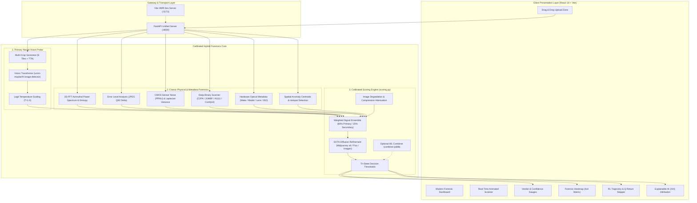
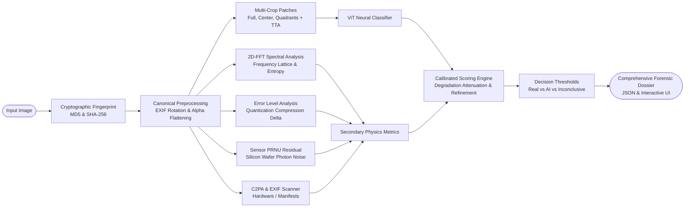
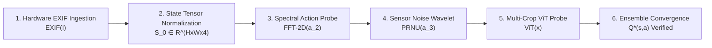

# AI Image Detector — AI Image Detection & Multi-Signal Forensics System

[](https://fastapi.tiangolo.com)
[](https://pytorch.org)
[](https://reactjs.org)
[](https://tailwindcss.com)
[](https://opencv.org)
[](LICENSE)

> **Enterprise-Grade AI Image Detection, Deepfake Forensics & Digital Provenance Verification Platform**  
> Combines Deep Vision Transformer (ViT) classification with classic computer vision physics (2D-FFT, ELA, PRNU sensor noise) and cryptographic C2PA header provenance, styled with the **Google Stitch** design system.

---

## Complete Documentation

> [!TIP]
> For in-depth mathematical formulations, data schemas, evaluation benchmarks, and forensic physics derivations, please read the complete [**Comprehensive Technical Documentation (DOCUMENTATION.md)**](DOCUMENTATION.md).

---

## System Architecture



---

## End-to-End Verification Pipeline



---

## Core Detection Pillars

### 1. Primary Neural Vision Classifier (ViT)
- **Model**: [`umm-maybe/AI-image-detector`](https://huggingface.co/umm-maybe/AI-image-detector) (fine-tuned Vision Transformer).
- **Multi-Crop Sliding Window**: Automatically decomposes images into multiple patches (center crop and spatial quadrants) with Test-Time Augmentation (TTA horizontal flipping).
- **Spatial Agreement**: Calculates patch standard deviation $\sigma_{\text{crop}}$ to detect localized inpainting or composite manipulation.
- **Dynamic Label Resolution**: Automatically binds labels at runtime via `model.config.id2label`.
- **Logit Temperature Scaling**: Calibrates posterior confidence probabilities using temperature parameter $T$.

### 2. Secondary Computer Vision Forensics (Physics Engine)
- **2D Fast Fourier Transform (2D-FFT)**: Azimuthal frequency power scan detecting unnatural synthetic checkerboard/lattice artifacts vs. continuous $1/f$ natural photographic falloff.
- **Error Level Analysis (ELA)**: Evaluates differential JPEG compression quantization residuals at quality factor $92$ to expose composite splicing.
- **Sensor PRNU & Laplacian Residuals**: Estimates Photo-Response Non-Uniformity (sensor photon noise) and high-frequency edge variance to distinguish physical camera sensor noise from diffusion over-smoothing.
- **Hardware EXIF & Deep C2PA Manifest Scanner**: Inspects camera hardware tags (Make, Model, Lens, ISO, Shutter, EV) and scans binary JUMBF boxes for C2PA Content Credentials manifests (Adobe Firefly, OpenAI DALL-E, Google SynthID, Microsoft Copilot) or diffusion parameter chunks (ComfyUI, Automatic1111, Midjourney).
- **4×4 Spatial Anomaly Grid**: Quantizes local variance across 16 spatial cells ($A1 \dots D4$) and identifies top anomaly centroids.

### 3. Calibrated Scoring Engine (`backend/scoring.py`)
- **Primary vs. Secondary Weighting**: Vision Transformer contributes $75\text{--}85\%$ of the base probability, with secondary forensics contributing $15\text{--}25\%$.
- **Image Degradation Attenuation**: Automatically dampens secondary forensic weights if images are heavily downscaled ($<256\text{px}$) or compressed ($<0.12\text{ bytes/pixel}$).
- **SOTA Diffusion Refinement**: Cross-references ambiguous ViT predictions ($40\text{--}60\%$) on high-resolution images against silicon CMOS sensor noise physics to reliably identify Midjourney v6, FLUX.1, and SDXL outputs.
- **Tri-State Verdict Thresholds**:
  - $p_{\text{ai}} \ge 0.70$ $\rightarrow$ **AI-Generated Image (Synthetic Media)** (`riskLevel: CRITICAL`)
  - $p_{\text{ai}} \le 0.30$ $\rightarrow$ **Real Photograph (Authentic Capture)** (`riskLevel: LOW`)
  - $0.30 < p_{\text{ai}} < 0.70$ $\rightarrow$ **Inconclusive Forensic Analysis** (`riskLevel: ELEVATED`)

---

## Reinforcement Learning (RL) Verification Trajectory

The system visualizes an animated 6-step sequential verification policy illustrating step-by-step convergence toward optimal action return $Q^*(s, a)$:



---

## Quick Start Guide

### 1. Unified Fullstack Mode (Recommended)
FastAPI serves both the production React frontend and all forensic APIs from a single server on `http://127.0.0.1:8000`:

- **Windows (1-Click)**: Double-click **`start.bat`**.
  - Automatically installs dependencies if needed.
  - Builds the React client if missing.
  - Launches FastAPI and opens your default browser to `http://127.0.0.1:8000`.

- **Cross-Platform CLI**:
  ```bash
  python run.py
  # or: npm start
  ```

---

### 2. Fullstack Development Mode (Concurrent Hot-Reload)
Run both the Vite HMR development server (port 5173) and FastAPI auto-reload (port 8000) simultaneously:

- **Windows (1-Click)**: Double-click **`start_dev.bat`**.
- **CLI**:
  ```bash
  npm run fullstack
  # or: python run.py --dev
  ```

---

### 3. Manual Microservices Execution

#### Python Forensics Backend:
```bash
pip install -r backend/requirements.txt
python -m uvicorn backend.main:app --host 127.0.0.1 --port 8000 --reload
```
- Interactive Swagger documentation: `http://127.0.0.1:8000/docs`

#### React / Vite Frontend:
```bash
npm install
npm run dev
```
- Accessible at `http://localhost:5173/` (automatically proxies `/api/*` to `:8000`).

---

## REST API Endpoints

| Method | Endpoint | Description |
| :--- | :--- | :--- |
| `GET` | `/` | Serves React Single-Page Application (SPA) or API overview |
| `GET` | `/api/health` | System status, active PyTorch device (`cuda`/`cpu`), model state, and temperature |
| `POST` | `/api/predict` | Multipart image upload returning complete multi-signal forensic dossier |
| `POST` | `/api/model/load` | Trigger background reload or warm-up of neural model weights |
| `GET` | `/docs` | Interactive OpenAPI / Swagger documentation |

---

## Evaluation & Benchmark Suite (`backend/evaluate.py`)

Run benchmark evaluations against datasets structured as `dataset/real/` and `dataset/ai/`:

```bash
# Run benchmark and print Accuracy, Precision, Recall, F1, ROC-AUC
python backend/evaluate.py --dataset path/to/dataset --device cuda

# Export detailed per-image metrics to CSV
python backend/evaluate.py --dataset path/to/dataset --save-csv evaluation_results.csv

# Automatically fit temperature scaling & scikit-learn combiner model
python backend/evaluate.py --dataset path/to/dataset --calibrate
```

Outputs:
- Accuracy, Precision, Recall, F1 Score, ROC-AUC
- Confusion matrix
- Accuracy sweep across multi-threshold intervals ($0.30 \dots 0.80$)
- Saves calibration parameters to `backend/config/calibration.json` and `backend/models/combiner.joblib`

---

## Project Repository Structure

```
├── DOCUMENTATION.md              # In-depth architectural & technical specification
├── README.md                     # Main project overview & quickstart
├── run.py                        # Unified cross-platform application launcher
├── start.bat                     # Windows 1-click production launcher
├── start_dev.bat                 # Windows 1-click hot-reload development launcher
├── package.json                  # Node.js frontend dependencies & scripts
├── vite.config.js                # Vite build configuration & API reverse proxy
├── tailwind.config.js            # Design tokens & color palette
├── backend/
│   ├── main.py                   # FastAPI application, CV algorithms, ViT inference
│   ├── scoring.py                # Calibrated scoring engine & signal ensemble logic
│   ├── evaluate.py               # Benchmark harness & calibration suite
│   ├── requirements.txt          # Python backend dependencies
│   ├── config/calibration.json   # Dynamic calibration parameters (temperature, thresholds)
│   └── models/                   # Optional trained scikit-learn combiner models
└── src/
    ├── App.jsx                   # Main React SPA component & state coordinator
    ├── services/pythonBackend.js # API communication layer & offline fallback bridge
    ├── data/forensicSamples.js   # Built-in demonstration samples & client algorithms
    └── components/
        ├── detection/            # Analysis scanner, heatmap, evidence grid, XAI, RL
        ├── dashboard/            # Hero section & quick testing actions
        ├── history/              # Local storage persistent investigation log
        ├── analytics/            # Global platform metrics & latency charts
        ├── howitworks/           # Interactive forensic methodology guide
        └── layout/               # Topbar, sidebar, status monitors
```

---

## License

This project is licensed under the [MIT License](LICENSE).
